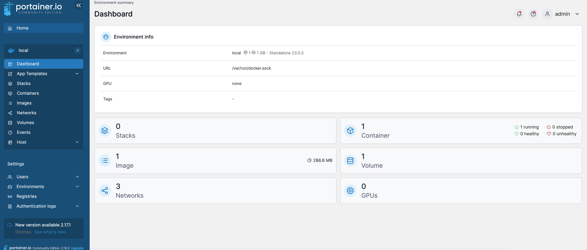

# install base cmd
```
sudo su 
apt-get update
apt-get install lsof
apt-get install tree
apt-get install vim
apt-get remove docker docker-engine docker.io containerd runc
```

# install docker

```

function install_docker(){
  # Update the apt package index and install packages to allow apt to use a repository over HTTPS:
  apt-get install \
    ca-certificates \
    curl \
    gnupg
  install -m 0755 -d /etc/apt/keyrings
  
  # 2.Add Docker’s official GPG key:
   install -m 0755 -d /etc/apt/keyrings
  curl -fsSL https://download.docker.com/linux/debian/gpg |  gpg --dearmor -o /etc/apt/keyrings/docker.gpg
   chmod a+r /etc/apt/keyrings/docker.gpg
  
  # 3.Use the following command to set up the repository
 
  echo \
  "deb [arch="$(dpkg --print-architecture)" signed-by=/etc/apt/keyrings/docker.gpg] https://download.docker.com/linux/debian \
  "$(. /etc/os-release && echo "$VERSION_CODENAME")" stable" | \
  tee /etc/apt/sources.list.d/docker.list > /dev/null
  
  apt-get update
  apt-get install docker-ce docker-ce-cli containerd.io docker-buildx-plugin docker-compose-plugin
  groupadd docker
  /usr/sbin/usermod -aG docker $USER
  newgrp docker
}
```


# install portainer

```

function install_docker_portainer_data(){
  docker volume create portainer_data
  docker run -d -p 8000:8000 -p 9443:9443 --name portainer --restart=always -v /var/run/docker.sock:/var/run/docker.sock -v portainer_data:/data portainer/portainer-ce:2.16.2
}
```


**remember open port 8000 and 9443 at your device**


